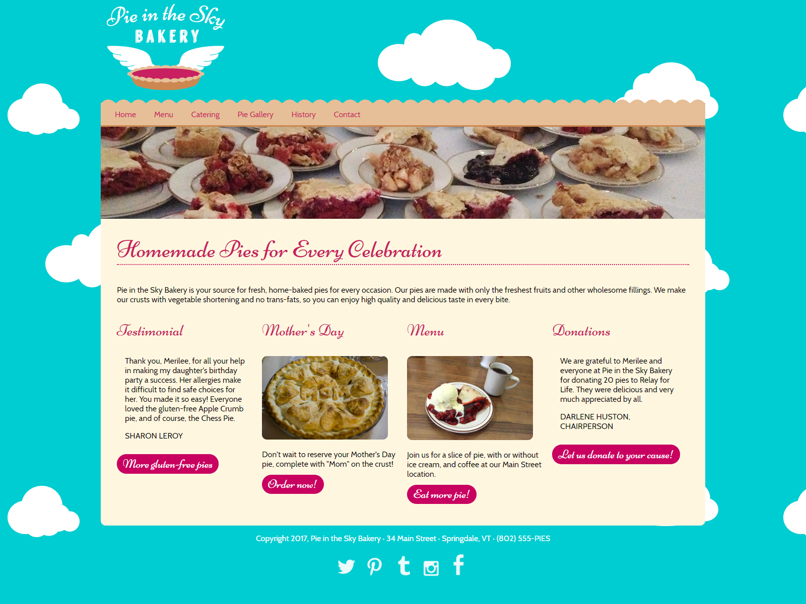

# Bakery Website

This project is a simple HTML page that showcases various CSS techniques, including Float, Flexbox, and Grid. It was created as part of a practice exercise from the Front End Master course by Jen Kramer. The website features a clean and visually appealing design, demonstrating how these CSS layout techniques can be effectively utilized.

## Features

- Responsive layout using CSS Grid and Flexbox
- Clean design showcasing bakery items
- Use of CSS Float for specific elements

## Visual Design

Below is a visual representation of the website's home page:

## Getting Started

To view the website locally, follow these steps:

1. Clone the repository or download the files.
2. Open the `index.html` file in your web browser.
3. Explore the design and layout!

## Technologies Used

- HTML5
- CSS3 (Float, Flexbox, Grid)

## Acknowledgments

- Thank you to Jen Kramer for the Front End Master course that inspired this project.
